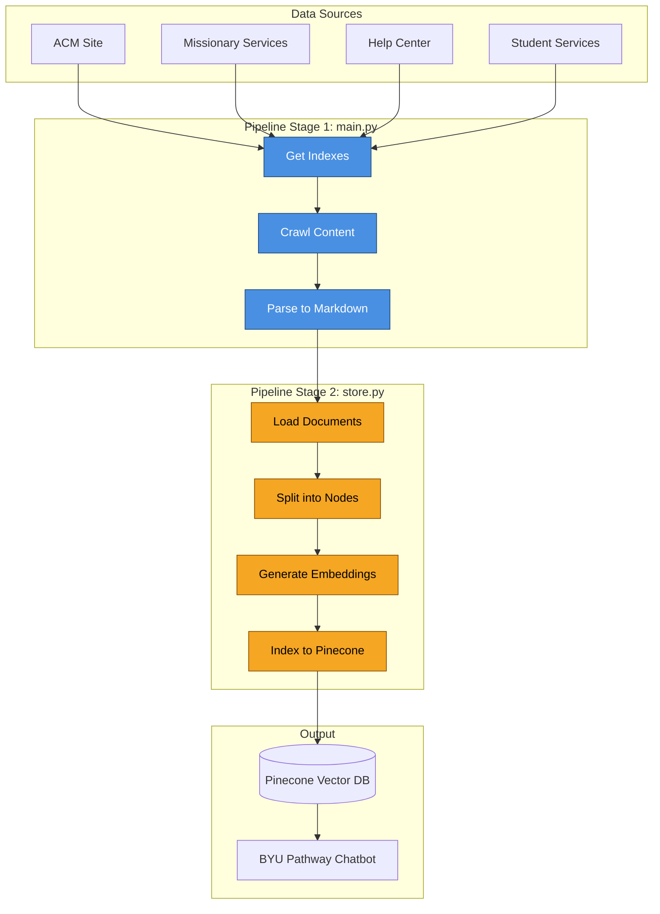
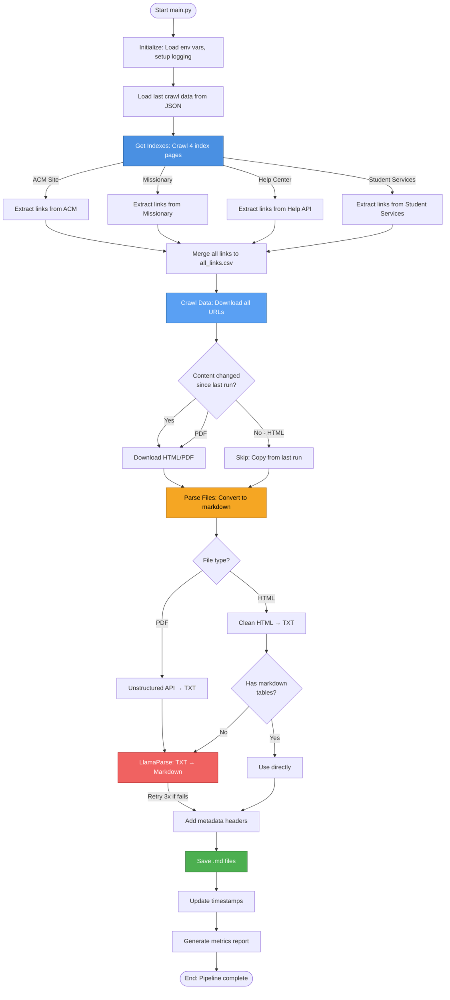

# DOCUMENTATION - BYU Pathway Indexer

**Developer Documentation for the BYU Pathway Website Indexing Pipeline**

---

## Table of Contents

1. [Overview](#1-overview)
2. [Getting Started](#2-getting-started)
3. [Pipeline Overview & Dependencies](#3-pipeline-overview--dependencies)
4. [Main Pipeline: `poetry run python main.py`](#4-main-pipeline-poetry-run-python-mainpy)
5. [Vector Indexing Pipeline: `poetry run python store.py`](#5-vector-indexing-pipeline-poetry-run-python-storepy)
6. [User Feedback Pipeline: `poetry run python extract_questions.py`](#6-user-feedback-pipeline-poetry-run-python-extract_questionspy)
7. [Complete Data Flow](#7-complete-data-flow)
8. [Project Structure](#8-project-structure)
9. [Core Concepts Explained](#9-core-concepts-explained)
10. [Data Management](#11-data-management)
11. [Common Tasks & How-Tos](#14-common-tasks--how-tos)
12. [Advanced Topics](#15-advanced-topics)
13. [Appendix & Quick Reference](#16-appendix--quick-reference)

---

## 1. Overview

### What is this project?

The **BYU Pathway Indexer** is a data pipeline that powers the [Missionary-Assistant Chatbot](https://missionary-chat.onrender.com/). _For details on the chatbot codebase, see the [Missionary Assistant Repository](https://github.com/DallanQ/pathway-chatbot/)_. This pipeline automatically:

1. **Crawls** multiple BYU Pathway websites to collect help content
2. **Downloads** HTML pages and PDF documents
3. **Converts** everything to clean markdown format
4. **Splits** content into small, smart chunks (called "nodes")
5. **Creates** vector embeddings (numerical representations) of each chunk
6. **Stores** everything in a searchable vector database (Pinecone)
7. **Enables** the chatbot to find and answer questions accurately

### High-Level System Architecture



---

## 2. Getting Started

### Prerequisites

Before you begin, make sure you have:

- **Python 3.12** (specifically 3.12.x, not 3.11 or 3.13)
- **Poetry** (package manager for Python)
- **API Keys** for:
  - LlamaParse (document parsing)
  - OpenAI (embeddings)
  - Pinecone (vector database)
  - Langfuse (chatbot telemetry)
  - Check [.env.example](https://github.com/DallanQ/pathway-indexer/blob/main/.env.example) for more

### Installation Steps

1. **Clone the repository**

   ```bash
   git clone <repository-url>
   cd pathway-indexer
   ```

2. **Install dependencies and set up pre-commit hooks**

   ```bash
   make install
   ```

   This command runs `poetry install` and sets up code quality tools.

3. **Activate the virtual environment**

   For Poetry 2.x:

   ```bash
   source .venv/bin/activate
   ```

   Or use `poetry run` before each command:

   ```bash
   poetry run python main.py
   ```

4. **Set up your environment variables**

   Copy the example file and fill in your API keys:

   ```bash
   cp .env.example .env
   ```

   Edit `.env` and add your keys (see [Configuration](#10-configuration-and-external-services) section).

### Development vs Production Environments

**This project has two environments:**

#### Development Environment (Your Local Computer)

**Recommended Setup**: Linux or WSL (Windows Subsystem for Linux)

**Why WSL/Linux?**

- Prevents Windows-specific issues:
  - Missing C compilers and build tools
  - Path and file system incompatibilities
  - Driver conflicts
  - Binary compatibility problems
- Ensures smooth setup and execution

**When to use local development:**

- Testing code changes
- Debugging issues
- Quick experiments with small data sets
- Learning the codebase

**API Keys for Development:**

- **OpenAI API key**: Request from @DallanQ (provided for development)
- **Other services** (Pinecone, LlamaParse, Langfuse): Get your own free/trial accounts

#### Production Environment (Dallan's Machine)

**Access**: SSH connection to Dallan's server

**User Accounts Available**:

- `pathway` - For production crawls
- Individual accounts (Development) - Named after each developer (e.g., `ernest`, `christopher`)

**When to use production environment:**

- Weekly crawls
- Generating production data

**Why use production environment?**

- ⚡ **Much faster** - More powerful hardware
- 🌐 **Stable network** - No home internet interruptions
- ⚠️ **Critical**: If main.py crashes or stops during a long run (>1 hour), you must restart from the beginning. Running on a stable server prevents this.

**API Keys for Production:**

- All production API keys are already configured
- No need to set up your own keys
- Keys are in the production `.env` file

**SSH Access:**
Contact @DallanQ to get:

1. SSH key file (`.pem`)
2. Your individual account credentials
3. Production environment setup instructions

### First Run

**Choose your environment:**

- 🖥️ **Local (Development)**: For testing and learning
- 🚀 **Production Server**: For actual crawls

#### Running Locally (Development)

1. **Update your .env file**

   ```
   DATA_PATH=data/adata_12_01_25/
   ```

   _Make sure to **change the folder name each time you run the pipeline** so you don’t overwrite previous data. You **do not** need to manually create the directory—the script will automatically create it if it doesn’t already exist._

2. **Run the main pipeline** (this usually takes >2hrs)

   ```bash
   poetry run python main.py
   ```

3. **Run the vector indexer** (after main.py completes)
   ```bash
   poetry run python store.py
   ```

#### Running on Production Server (Recommended)

1. **SSH into production server**

   ```bash
   ssh your_username@dallan-server
   ```

2. **Navigate to project and run**
   ```bash
   cd /path/to/pathway-indexer
   poetry run python main.py
   poetry run python store.py
   ```

### Troubleshooting Setup Issues

#### "python: command not found" or "python3.12: command not found"

**Solution**: You may not have Python 3.12 installed, or it's not in your PATH.

- Check your Python version: `python --version` or `python3 --version`
- If you have Python 3.12 but the command doesn't work, try: `python3.12 --version`
- If you don't have Python 3.12, install it using your system's package manager

#### "poetry: command not found"

**Solution**: Poetry is not installed.

Install Poetry:

```bash
curl -sSL https://install.python-poetry.org | python3 -
```

Add Poetry to your PATH (usually `~/.local/bin`).

#### "ModuleNotFoundError" or "library not found"

**Solution**: You haven't activated your virtual environment or haven't run `poetry install`.

1. First, ensure dependencies are installed:

   ```bash
   poetry install
   ```

2. Then activate the virtual environment:

   ```bash
   source .venv/bin/activate
   ```

3. Or use `poetry run` before your command:
   ```bash
   poetry run python main.py
   ```

---

## 3. Pipeline Overview & Dependencies

### The Three Main Scripts

This project has **three main scripts**, each with a specific purpose:

| Script                   | Purpose                                                  | When to Run                            |
| ------------------------ | -------------------------------------------------------- | -------------------------------------- |
| **main.py**              | Crawls websites, downloads content, converts to markdown | Weekly or when website content changes |
| **store.py**             | Creates vector embeddings and indexes to Pinecone        | **After main.py completes**            |
| **extract_questions.py** | Downloads chatbot telemetry from Langfuse                | Optional, for analysis                 |

### ⚠️ Important Dependency

**main.py MUST complete successfully before running store.py**

Why? Because store.py reads the markdown files created by main.py. If main.py hasn't run yet, store.py will have no files to process.

### What Each Script Does (High-Level)

#### main.py - Data Collection & Preparation

- **Input**: Website URLs from 4 BYU Pathway sites
- **Process**: Crawl → Download → Parse → Convert to markdown
- **Output**: Markdown files with metadata in `data/DATA_PATH/out/`
- **Duration**: 2-3hrs depending on content changes

#### store.py - Vector Indexing

- **Input**: Markdown files from main.py
- **Process**: Load → Split → Embed → Index
- **Output**: Vector embeddings in Pinecone database
- **Duration**: 5-15 minutes depending on the number of documents

#### extract_questions.py - User Feedback Analysis

- **Input**: Langfuse API (user interaction logs)
- **Process**: Download traces → Extract questions → Save to CSV
- **Output**: CSV file with user questions and other metadata
- **Duration**: 1-5 minutes depending on date range

---

## 4. Main Pipeline: `poetry run python main.py`

### Purpose

The main pipeline crawls BYU Pathway websites, downloads all help content (HTML pages and PDFs), and converts everything to clean markdown format ready for indexing.

### When to Run It

- **Weekly**: To pick up new content and updates
- **When notified**: Usually if Elder Edwards notifies, or one of the content-source teams (Help Center, Missionary Services, Student Services, etc.) publishes new content
- **After website changes**: If you know specific pages were updated

### Step-by-Step Execution Flow



### Common Errors and Solutions

#### Error: "Failed to fetch URL: 403 Forbidden"

**Cause**: Some websites block automated requests.

**Solution**: The pipeline automatically retries with Playwright (browser automation). If it still fails, check if the website requires authentication.

#### Error: "LlamaParse API error: Rate limit exceeded"

**Cause**: Too many requests to LlamaParse.

**Solution**: The pipeline has retry logic. Wait a few minutes and it will continue automatically. If it persists, check your LlamaParse API quota.

#### Error: "No markdown files generated"

**Cause**: Something went wrong during parsing.

**Solution**:

1. Check `pipeline_detailed_log.jsonl` for detailed error messages
2. Look at `error.csv` for a summary of failures
3. Verify your `.env` file has correct API keys

#### Warning: "N files with only metadata (no content)"

**Cause**: LlamaParse returned empty content for some files.

**Solution**: This is usually okay - some pages may be empty or navigation-only. Check the list in the metrics output to verify they're not important pages.

---

## 5. Vector Indexing Pipeline: `poetry run python store.py`

### Purpose

The vector indexing pipeline takes the markdown files created by main.py, splits them into small chunks (nodes), generates vector embeddings, and stores everything in Pinecone for fast semantic search.

### When to Run It

- **After main.py completes successfully**
- **Do not run this before main.py** - you need the markdown files first

### Common Errors and Solutions

#### Warning: "N files have 0 nodes"

**Cause**: Some markdown files produced no indexable content.

**Solution**: Check `error/error.csv` to see which files failed. Common causes:

- Empty files
- Files with only navigation/headers
- Parsing failures from main.py

Review the original markdown files in `out/from_html/` or `out/from_pdf/` to see if they have content. If they're empty, the issue is in main.py parsing, not store.py indexing.

---

## 6. User Feedback Pipeline: `poetry run python extract_questions.py`

### Purpose

This script downloads user interaction data from Langfuse (an LLM monitoring platform) to analyze real questions that users ask the chatbot. This helps improve retrieval quality and identify common issues.

### When to Run It

- **Optional** - Not required for the main pipeline
- **Weekly or monthly** - To update the streamlit app that analyzes the questions

### Command-Line Usage

```bash
# Extract last 7 days (default)
poetry run python extract_questions.py

# Extract last 30 days
poetry run python extract_questions.py --days 30
```

### What Data It Collects

The script downloads two types of data from Langfuse:

1. **Traces**: Complete user interaction sessions
2. **Observations**: Individual steps within each trace (queries, responses, etc.)

And extracts:

- **Date**: When the interaction happened
- **Country**: User's country (if available)
- **User Language**: User's preferred language
- **State/City**: User's location (if available)
- **Question**: The actual question the user asked
- **Output**: The chatbot's response
- **Metadata**: Additional context about the interaction
- **User Feedback**: Thumbs up/down, rating, or comments

### Output Files

```
data/DATA_PATH/langfuse/
├── traces_YYYY-MM-DD.csv                 # Raw trace data
├── observations_YYYY-MM-DD.csv           # Raw observation data
└── extracted_user_inputs_YYYY-MM-DD.csv  # Processed user questions
```

### Common Errors and Solutions

#### Error: "Langfuse API authentication failed"

**Cause**: Missing or incorrect API keys.

**Solution**: Check your `.env` file has:

```
LANGFUSE_HOST=https://us.cloud.langfuse.com
LANGFUSE_SECRET_KEY=<your-secret-key>
LANGFUSE_PUBLIC_KEY=<your-public-key>
```

#### Error: "No data found for the specified date range"

**Cause**: No user interactions during that time period.

**Solution**: This is normal if the chatbot hasn't been used recently. Try a longer date range (e.g., `--days 30`). _Note: Langfuse’s free tier only retains data for 30 days._

#### Warning: "Some observations have no input data"

**Cause**: Some interactions in Langfuse don't have user input (internal system calls, etc.).

**Solution**: This is expected and okay. The script filters out empty inputs automatically.

---

## 7. Complete Data Flow

### Data Transformations at Each Stage

| Stage                   | Input Format     | Transformation                          | Output Format                    |
| ----------------------- | ---------------- | --------------------------------------- | -------------------------------- |
| **Get Indexes**         | HTML index pages | CSS selectors extract links             | CSV with URLs + metadata         |
| **Crawl Data**          | URLs from CSV    | HTTP requests / Playwright              | HTML/PDF binary files            |
| **Parse Files**         | HTML/PDF files   | BeautifulSoup, Unstructured, LlamaParse | Markdown (.md) with YAML headers |
| **Split Documents**     | Markdown files   | AltNodeParser splits on paragraphs      | TextNodes with context           |
| **Generate Embeddings** | TextNode.text    | OpenAI API transforms text              | 3072-dim vectors                 |
| **Index to Pinecone**   | Nodes + vectors  | Upload to cloud database                | Searchable vector index          |

### Where to Find Processed Data

- **URLs to crawl**: `data/DATA_PATH/all_links.csv`
- **Downloaded HTML**: `data/DATA_PATH/crawl/html/*.html`
- **Downloaded PDFs**: `data/DATA_PATH/crawl/pdf/*.pdf`
- **Markdown output**: `data/DATA_PATH/out/from_html/*.md` and `out/from_pdf/*.md`
- **Vector database**: Pinecone (cloud-hosted, query via API)
- **Processing logs**: `data/DATA_PATH/pipeline_detailed_log.jsonl`
- **Error reports**: `data/DATA_PATH/error/error.csv`
- **Node statistics**: `data/DATA_PATH/node_counts_log.json`

---

## 8. Project Structure

### Directory Layout

```
pathway-indexer/
├── main.py                      # Main crawler/parser pipeline entry point
├── store.py                     # Vector indexing pipeline entry point
├── extract_questions.py         # Langfuse feedback extraction entry point
├── pathway_indexer/             # Core business logic package
│   ├── __init__.py
│   ├── crawler.py              # Orchestrates web crawling
│   ├── get_indexes.py          # Fetches index pages and extracts URLs
│   ├── parser.py               # Orchestrates file parsing
│   └── memory.py               # Handles state persistence (JSON files)
├── utils/                       # Utility modules
│   ├── indexes.py              # Index page crawling logic (selectors, API calls)
│   ├── crawl.py                # URL content fetching (HTTP, Playwright)
│   ├── parser.py               # File conversion (HTML/PDF → Markdown)
│   ├── hyper_functions.py      # Custom node parser (AltNodeParser) & pipeline
│   ├── splitter.py             # Document splitting utilities
│   ├── langfuse_downloader.py  # Downloads Langfuse data
│   ├── langfuse_processor.py   # Processes user questions from Langfuse
│   ├── calendar_format.py      # Special formatting for calendar content
│   ├── tools.py                # Helper utilities (hash generation, etc.)
│   ├── log_analyzer.py         # Analyzes pipeline logs
│   └── retrieve.py             # Retrieval evaluation tools
├── data/                       # Data directory (gitignored)
│   └── [timestamped folders]/  # e.g., adata_12_01_25/
├── tests/                      # Test files
│   └── test_foo.py             # Placeholder test
├── notebooks/                  # Jupyter notebooks (exploratory work)
├── .env                        # Environment variables (gitignored)
├── .env.example                # Environment variables template
├── pyproject.toml              # Poetry dependencies and config
├── Makefile                    # Convenience commands (install, test, etc.)
├── README.md                   # Project documentation
└── CONTRIBUTING.md             # Contribution guidelines
└── DOCUMENTATION.md            # This file
```

### Key Modules and Their Responsibilities

#### pathway_indexer/ Package (Core Orchestration)

- **crawler.py**: High-level crawler orchestration

  - Calls `utils.crawl` to download content
  - Manages progress tracking
  - Handles error collection

- **get_indexes.py**: Index collection

  - Crawls 4 different index pages
  - Extracts URLs with metadata
  - Merges and deduplicates into `all_links.csv`

- **parser.py**: Parser orchestration

  - Manages file conversion workflow
  - Handles change detection
  - Coordinates LlamaParse API calls
  - Adds metadata to markdown files

- **memory.py**: State management
  - Loads/saves `last_crawl_detail.json`
  - Handles CSV copying for incremental updates
  - Manages timestamp tracking

#### utils/ Package (Implementation Details)

- **indexes.py**: Index page scraping

  - Defines CSS selectors for each site
  - Implements site-specific crawling logic
  - Handles Help Center API pagination
  - Scrapes Student Services dynamic content

- **crawl.py**: Content downloading

  - Implements HTTP requests with retry logic
  - Fallback to Playwright for 403 errors
  - Generates content hashes for change detection
  - Handles HTML extraction and PDF downloading

- **parser.py**: File conversion

  - Cleans HTML (removes navigation, scripts)
  - Converts HTML to markdown via markdownify
  - Sends PDFs to Unstructured API
  - Sends text to LlamaParse for better markdown
  - Cleans final markdown output

- **hyper_functions.py**: Advanced indexing

  - **AltNodeParser**: Custom document splitter
  - Implements context window logic
  - Handles header propagation
  - Runs the embedding pipeline
  - Adds sequence numbers to nodes

- **splitter.py**: Document splitting utilities

  - Helper functions for AltNodeParser
  - Paragraph detection
  - Header extraction

- **langfuse_downloader.py**: Feedback collection

  - Connects to Langfuse API
  - Paginates through traces and observations
  - Saves to CSV files

- **langfuse_processor.py**: Feedback processing

  - Extracts user questions from traces
  - Parses metadata (country, language, location)
  - Structures data for analysis

- **calendar_format.py**: Special formatting

  - Handles calendar-specific content
  - Formats dates and events

- **tools.py**: General utilities

  - Hash-based filename generation
  - File I/O helpers
  - String manipulation

- **log_analyzer.py**: Log analysis

  - Parses `pipeline_detailed_log.jsonl`
  - Generates summary reports
  - Identifies errors and patterns

- **retrieve.py**: Retrieval testing
  - Tools for evaluating retrieval quality
  - Benchmarking utilities

---

## 9. Core Concepts Explained

This section explains technical concepts in simple terms. If you're already familiar with these topics, feel free to skip ahead.

### What is RAG (Retrieval-Augmented Generation)?

**RAG** is a technique that helps AI chatbots give accurate, up-to-date answers by combining two things:

1. **Retrieval**: Finding relevant information from a knowledge base
2. **Generation**: Using an AI model (like GPT-4) to write an answer based on that information

**Without RAG**: The chatbot only knows what was in its training data (which might be outdated or missing specific information).

**With RAG**: The chatbot searches a database for relevant content, then uses that content to generate an accurate answer.

**Example**:

- User asks: "How do I reset my password?"
- **Retrieval**: Find the password reset help article
- **Generation**: Use GPT-4 to write a friendly answer based on that article

This project implements the **Retrieval** part. It creates a searchable knowledge base that the chatbot queries.

### What are Vector Embeddings?

**Vector embeddings** are numerical representations of text that capture meaning.

Think of it like coordinates on a map:

- "How do I enroll?" might be at coordinates [0.2, 0.8, 0.3, ...]
- "How can I sign up?" might be at coordinates [0.21, 0.79, 0.31, ...] (very close!)
- "What's the weather?" might be at coordinates [-0.5, 0.1, -0.8, ...] (far away)

**Key points**:

- Each piece of text becomes a list of numbers (a vector)
- Similar meanings = similar vectors (close together in space)
- We use 3072 dimensions (3072 numbers per text)
- This lets us search by meaning, not just keywords

**Example**:
If someone asks "How do I register?", the system can find articles about "enrollment" and "signing up" even if they don't use the exact word "register".

### What is a Vector Database (Pinecone)?

A **vector database** is like a search engine for embeddings.

**Regular database**: Searches for exact matches

- Find all records where `status = "active"`

**Vector database**: Searches for similar meanings

- Find all documents similar to "how do I reset my password?"

**Pinecone** is a cloud service that:

- Stores millions of vectors
- Quickly finds the most similar vectors to a query
- Returns results in milliseconds

**Why we use it**: Traditional databases can't efficiently search by similarity. Pinecone is built specifically for this.

### Content Hashing and Change Detection

**Content hashing** creates a unique "fingerprint" for a file based on its content.

**How it works**:

1. Take the file's content
2. Run it through a hash function (SHA-256)
3. Get a unique string like `"a3f5b9c2d1e..."`
4. If content changes even slightly, the hash changes completely

**Why we use it**:

- Detect if a webpage has changed since our last crawl
- Skip downloading unchanged content (saves time and API costs)
- Track which files need re-processing

**Example**:

```python
# First crawl
hash_1 = sha256("Hello world").hexdigest()  # "a948904f2f..."

# Second crawl - content unchanged
hash_2 = sha256("Hello world").hexdigest()  # "a948904f2f..." (same!)
# → Skip re-downloading

# Third crawl - content changed
hash_3 = sha256("Hello world!").hexdigest()  # "c0535e4b..." (different!)
# → Re-download and re-process
```

### Node Parsing and Context Windows

**Node parsing** is the process of splitting documents into small, searchable chunks.

**Why split documents?**

- Documents are too long to process all at once
- We want to find the specific paragraph that answers a question
- Smaller chunks = more precise search results

**Context windows** are extra text we include to help the system understand context.

**Example without context**:

```
Node text: "Click the blue button."
```

→ The chatbot doesn't know what page we're talking about

**Example with context**:

```
Embed context (for search):
"To reset your password, go to Settings. Click the blue button."

LLM context (for answer generation):
"Account Security > Password Management
To reset your password, go to Settings. Click the blue button.
You'll receive an email confirmation."
```

→ Much better! The chatbot knows we're talking about password reset

**Our settings**:

- **Embed context**: Include 1 paragraph before/after (up to 400 chars) - Used for search
- **LLM context**: Include 2 paragraphs before/after (up to 700 chars) - Used for generating answers

### LlamaIndex Framework Basics

**LlamaIndex** is a Python framework that makes it easy to build RAG systems.

**What it provides**:

- Document loaders (read files)
- Node parsers (split documents)
- Embedding models (generate vectors)
- Vector stores (connect to Pinecone)
- Retrievers (search for relevant content)

**Why we use it**: Instead of building all this from scratch, LlamaIndex provides tested, optimized components.

**Our custom extensions**:

- **AltNodeParser**: We built our own node parser with special context window logic
- **Custom metadata**: We add BYU Pathway-specific metadata (heading, subheading, role)

Think of LlamaIndex like a toolkit - it gives us the building blocks, and we assemble them in a custom way for our needs.

---

## 11. Data Management

### Output Files and What They Contain

#### CSV Files

- **all_links.csv**: Master list of all URLs to crawl

  ```
  Section, Subsection, Title, URL, Role, filename
  "Getting Started", "Account Setup", "Create Account", "https://...", "ACM", "1a2b3c4d"
  ```

- **output_data.csv**: Metadata for crawled files

  ```
  Heading, Subheading, Title, URL, Filepath, Content Type, Content Hash, Last Update, Role
  ```

- **error/error.csv**: Failed URLs and non-indexable files
  ```
  Section, Subsection, Title, URL, Role, filename
  ```

#### Log Files

- **pipeline_detailed_log.jsonl**: Structured log of every processing step

  ```jsonl
  {"stage": "crawl", "status": "SUCCESS", "url": "https://...", "timestamp": "..."}
  {"stage": "parse", "status": "FAILED_LLAMA_PARSE", "url": "https://...", "error": "..."}
  ```

- **processed_files.log**: List of successfully processed URLs

- **skipped_files.log**: List of skipped (unchanged) URLs

- **metrics_explanation.log**: Human-readable summary of pipeline metrics

#### JSON Files

- **last_crawl_detail.json**: Timestamp of last successful crawl

  ```json
  {
    "last_crawl_timestamp": "2024-12-01T14:30:00"
  }
  ```

- **node_counts_log.json**: Number of nodes created per file
  ```json
  {
    "1a2b3c4d.md": 15,
    "5e6f7a8b.md": 8,
    ...
  }
  ```

### Understanding Metrics

Both pipelines generate detailed metrics. Here's how to interpret them:

#### main.py Metrics

```json
{
  "Total documents from indexes": 450,
  "Files processed in Crawler": 450,
  "Files skipped (no change)": 320,
  "Documents sent to LlamaParse": 130,
  "Documents successfully processed": 128,
  "Documents with errors": 2,
  "MD files generated": 448
}
```

**Key metrics**:

- **Files skipped**: High number = good! Means most content hasn't changed
- **Documents sent to LlamaParse**: Files that needed markdown conversion
- **Documents with errors**: Should be low; check error.csv if high
- **MD files generated**: Should be close to total documents

#### store.py Metrics

```json
{
  "Files loaded for indexing": 448,
  "Files with indexable content": 445,
  "Files with 0 nodes": 3,
  "Total nodes processed": 6,240,
  "Average nodes per file": 14.0
}
```

**Key metrics**:

- **Files with 0 nodes**: Should be low; these files won't be searchable
- **Total nodes**: More nodes = more granular search
- **Average nodes per file**: 10-20 is typical for help articles

### Checking Data Quality

#### Quick Health Check

```bash
# 1. Check if main.py completed successfully
cat data/adata_12_01_24/metrics_explanation.log | grep "completed"

# 2. Check for errors
cat data/adata_12_01_24/error/error.csv | wc -l

# 3. Check number of markdown files
ls data/adata_12_01_24/out/from_html/*.md | wc -l

# 4. Check number of nodes created
cat data/adata_12_01_24/node_counts_log.json | grep -o ': [0-9]*' | awk '{sum+=$2} END {print sum}'
```

#### Investigating Issues

If something looks wrong:

1. **Check pipeline_detailed_log.jsonl**

   ```bash
   # Find all errors
   cat data/.../pipeline_detailed_log.jsonl | grep "FAILED"
   ```

2. **Check error.csv**

   ```bash
   # See which URLs failed
   cat data/.../error/error.csv
   ```

3. **Check a sample markdown file**

   ```bash
   # Make sure it has content
   cat data/.../out/from_html/1a2b3c4d.md
   ```

4. **Check node counts**
   ```bash
   # Find files with 0 nodes
   cat data/.../node_counts_log.json | grep ': 0'
   ```

---

## 14. Common Tasks & How-Tos

### How to Investigate Errors in Logs

**Task**: Debug issues using log files

**Log files available**:

1. `pipeline_detailed_log.jsonl` - Structured processing log
2. `error.csv` - Failed URLs and files
3. `metrics_explanation.log` - Human-readable summary

#### Investigate crawling errors

```bash
# Find all HTTP errors
cat data/.../pipeline_detailed_log.jsonl | grep "FAILED_HTTP_ERROR"

# Find all Playwright errors
cat data/.../pipeline_detailed_log.jsonl | grep "FAILED_PLAYWRIGHT_ERROR"

# See which URLs failed
cat data/.../error/error.csv | grep -v "^Section"  # Skip header
```

#### Investigate parsing errors

```bash
# Find LlamaParse failures
cat data/.../pipeline_detailed_log.jsonl | grep "LLAMA_PARSE_FAILED"

# Find empty responses from LlamaParse
cat data/.../pipeline_detailed_log.jsonl | grep "LLAMA_PARSE_EMPTY"

# Count how many files were sent to LlamaParse
cat data/.../pipeline_detailed_log.jsonl | grep "LLAMA_PARSE_SENT" | wc -l
```

#### Investigate indexing errors

```bash
# Find files with 0 nodes
cat data/.../node_counts_log.json | grep ': 0'

# Count total nodes
cat data/.../node_counts_log.json | grep -o ': [0-9]*' | awk '{sum+=$2} END {print sum}'

# Check average nodes per file
# (see metrics_explanation.log)
cat data/.../metrics_explanation.log | grep "Average nodes per file"
```

---

## 15. Advanced Topics

These topics are brief explanations of complex internals. You don't need to understand these to use the pipeline, but they're useful if you need to modify core functionality.

### AltNodeParser: What It Does and Why It Matters

**AltNodeParser** is a custom document splitter (node parser) that we built specifically for this project.

**What it does**:

1. Splits markdown documents into paragraphs
2. Adds surrounding paragraphs for context
3. Propagates markdown headers to each node
4. Attaches metadata (url, heading, subheading, title, role, headers)

**Why we built it**:

- LlamaIndex's default node parsers don't support our context window requirements
- We need fine-grained control over what text is embedded vs. shown to the LLM
- We want to include both index metadata (heading, subheading) and markdown headers (h1-h6)

**Key features**:

1. **Dual context windows**:

   - `embed_prev_next_paragraphs`: Context for embedding (search)
   - `include_prev_next_paragraphs`: Context for LLM (answer generation)

   This lets us optimize separately for search quality and answer quality.

2. **Header propagation**:

   - Each node knows what headers it's under (h1, h2, h3, etc.)
   - Helps with filtering (e.g., "only return nodes under 'Account Setup'")

3. **Metadata preservation**:
   - All metadata from the markdown frontmatter is attached to every node
   - Enables filtering by role, URL, heading, etc.

**File**: `utils/hyper_functions.py`

### Context Windows: Why We Include Surrounding Paragraphs

**Problem**: A single paragraph often lacks context.

**Example**:

```
"Click the blue button."
```

→ The chatbot doesn't know what page this is about, what the button does, or where to find it.

**Solution**: Include surrounding paragraphs.

**With embedding context** (for search):

```
"To reset your password, go to Account Settings. Click the blue button."
```

→ Now the search engine knows this is about password reset.

**With LLM context** (for answer generation):

```
"Account Security > Password Management
To reset your password, go to Account Settings in the top right corner.
Click the blue button labeled 'Reset Password'.
You'll receive a confirmation email within 5 minutes."
```

→ Much better! The chatbot can generate a complete answer.

**Why two different contexts?**

- **Embedding**: Needs to be concise for good search precision
- **LLM**: Needs to be comprehensive for good answer generation

**Our settings**:

- Embedding: 1 paragraph before/after, max 400 chars
- LLM: 2 paragraphs before/after, max 700 chars

**Trade-offs**:

- More context = Better understanding, but slower and more expensive
- Less context = Faster and cheaper, but worse answers

### Hash-Based Filename Generation

**Why use hashes instead of URLs?**

```python
# URL
"https://help.byupathway.edu/article/123-how-to-reset-your-password-and-recover-access"

# Hash
"a3f5b9c2"
```

**Benefits**:

1. **Consistent length**: All filenames are the same length
2. **No special characters**: URLs have `/`, `?`, `&` that break filesystems
3. **Collision-resistant**: CRC32 hash makes collisions extremely unlikely
4. **Traceable**: You can regenerate the hash from the URL to find the file

**How it works**:

```python
import zlib

def generate_hash_filename(url):
    hash_value = zlib.crc32(url.encode("utf-8"))
    return f"{hash_value:x}"  # Convert to hexadecimal string

# Example
url = "https://help.byupathway.edu/article/123"
filename = generate_hash_filename(url)  # "1a2b3c4d"
filepath = f"crawl/html/{filename}.html"  # "crawl/html/1a2b3c4d.html"
```

**Finding the original URL**:
Look it up in `all_links.csv`:

```bash
grep "1a2b3c4d" data/.../all_links.csv
```

**File**: `utils/tools.py`

### Retry Logic and Error Handling

The pipeline has extensive retry logic to handle transient failures.

**Example 1: HTTP requests** (utils/crawl.py)

```python
for attempt in range(3):  # Try 3 times
    try:
        response = requests.get(url, timeout=30)
        if response.status_code == 403:
            # Try Playwright instead
            content = fetch_with_playwright(url)
        else:
            content = response.content
        break  # Success!
    except Exception as e:
        if attempt == 2:  # Last attempt
            log_error(url, str(e))
        else:
            time.sleep(2 ** attempt)  # Exponential backoff: 1s, 2s, 4s
```

**Example 2: LlamaParse** (utils/parser.py)

```python
for attempt in range(3):
    try:
        result = llama_parse.load_data(text)
        if result:
            break  # Success!
    except Exception as e:
        if attempt == 2:
            log_error("LlamaParse failed after 3 attempts")
        else:
            time.sleep(5 * (attempt + 1))  # Wait 5s, 10s, 15s
```

**Example 3: OpenAI embeddings** (store.py)

```python
OpenAIEmbedding(
    max_retries=25,  # Retry up to 25 times
    timeout=180  # 3-minute timeout
)
# LlamaIndex handles retries automatically
```

**Why so much retry logic?**

- APIs sometimes have transient failures (rate limits, network hiccups)
- The pipeline processes hundreds of documents - we don't want one failure to break everything
- Automatic retries mean the pipeline can recover without manual intervention

### Special Domain Handling

Some websites require custom logic.

#### Help Center (help.byupathway.edu)

**Special handling**:

- Uses API pagination instead of scraping
- Extracts article content only (no navigation)
- Handles multiple article formats

**Code**: `utils/indexes.py` - `get_help_articles()`

#### Student Services (studentservices.byupathway.edu)

**Special handling**:

- JavaScript-rendered tabs (requires Playwright)
- Dynamic content loading
- Multiple navigation levels

**Code**: `utils/indexes.py` - `get_student_services_links()`

#### Articulate Content (rise.articulate.com, myinstitute.org)

**Special handling**:

- Returns 403 for automated requests
- Requires Playwright with full browser
- Longer timeouts needed

**Code**: `utils/crawl.py` - `fetch_with_playwright()`

---

## 16. Appendix & Quick Reference

### File Naming Conventions

- **Hash-based**: `{crc32_hash}.{extension}`

  - Example: `1a2b3c4d.html`, `5e6f7a8b.pdf`
  - Used for: Downloaded files, markdown output
  - Lookup: Use `all_links.csv` to map hash → URL

- **Timestamped**: `{description}_{YYYY-MM-DD}.{extension}`

  - Example: `traces_2024-12-01.csv`
  - Used for: Langfuse data exports

- **Descriptive**: `{site_name}.csv`
  - Example: `acm.csv`, `missionary.csv`
  - Used for: Individual site indexes

### CSV Schemas

#### all_links.csv

```
Section, Subsection, Title, URL, Role, filename
"Getting Started", "Account Setup", "Create Account | Login", "https://...", "ACM", "1a2b3c4d"
```

#### output_data.csv

```
Heading, Subheading, Title, URL, Filepath, Content Type, Content Hash, Last Update, Role
"Getting Started", "Account Setup", "Create Account", "https://...", "crawl/html/1a2b3c4d.html", "html", "a948904f...", "2024-12-01T14:30:00", "ACM"
```

#### error/error.csv

```
Section, Subsection, Title, URL, Role, filename
"Troubleshooting", "Login Issues", "Reset Password", "https://...", "ACM", "5e6f7a8b"
```

### Node Metadata Structure

```python
{
    "url": "https://help.byupathway.edu/article/123",
    "heading": "Getting Started",
    "subheading": "Account Setup",
    "title": "How to Create Your Account | Login",
    "role": "ACM",
    "header_1": "Account Setup",
    "header_2": "Creating Your Account",
    "header_3": "Step 1: Enter Your Information",
    "header_4": None,
    "header_5": None,
    "header_6": None,
    "sequence": 2,
    "filepath": "data/adata_12_01_24/out/from_html/1a2b3c4d.md",
    "paragraph": "<original paragraph without context>",
    "context": "<paragraph with surrounding context for LLM>"
}
```

### Useful Make Commands

```bash
# Setup
make install          # Install dependencies and pre-commit hooks
make build            # Build Python wheel

# Quality
make check            # Run linters and type checking
make test             # Run tests with coverage

# Data
make pull-data        # Download data from shared EC2
make push-data        # Upload data to shared EC2

# Cleaning
make clean            # Remove build artifacts
```

### Useful Poetry Commands

```bash
# Environment
poetry install                   # Install all dependencies
poetry install --with dev        # Install with dev dependencies
poetry update                    # Update all dependencies

# Running
poetry run python main.py        # Run main pipeline
poetry run python store.py       # Run indexer

# Shell
poetry shell                     # Activate virtual environment
# (Note: poetry shell removed in Poetry 2.x, use source .venv/bin/activate)

```

### Environment Variables Quick Reference

```bash
# Required for main.py
DATA_PATH=data/adata_12_01_24/
LLAMA_CLOUD_API_KEY=llx_your_key

# Required for store.py
OPENAI_API_KEY=sk_your_key
PINECONE_API_KEY=your_key
PINECONE_ENVIRONMENT=us-east-1
PINECONE_INDEX_NAME=pathway-chatbot

# Optional
UNSTRUCTURED_API_KEY=your_key
VOYAGE_API_KEY=your_key
LANGFUSE_HOST=https://us.cloud.langfuse.com
LANGFUSE_SECRET_KEY=sk-lf_your_key
LANGFUSE_PUBLIC_KEY=pk-lf_your_key
```

### Related Documentation Links

- **LlamaIndex**: https://docs.llamaindex.ai/
- **LlamaParse**: https://docs.cloud.llamaindex.ai/llamaparse
- **OpenAI Embeddings**: https://platform.openai.com/docs/guides/embeddings
- **Pinecone**: https://docs.pinecone.io/
- **Langfuse**: https://langfuse.com/docs
- **Poetry**: https://python-poetry.org/docs/
- **Playwright**: https://playwright.dev/python/

### Quick Troubleshooting Checklist

Before asking for help, check:

- [ ] Virtual environment activated? (`source .venv/bin/activate` or `poetry run`)
- [ ] Dependencies installed? (`poetry install`)
- [ ] .env file configured? (`cp .env.example .env` and fill in keys)
- [ ] DATA_PATH set correctly in .env?
- [ ] API keys valid and have quota remaining?
- [ ] Previous pipeline stage completed successfully?
- [ ] Logs checked for errors? (`pipeline_detailed_log.jsonl`, `error.csv`)
- [ ] Internet connection working?
- [ ] Pinecone index exists? (or let store.py create it)

### Getting Help

- **Logs**: Always check logs first - they usually explain what went wrong

---

_Last updated: November 2025_
